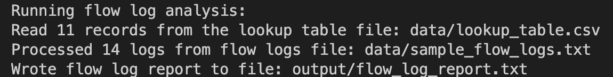
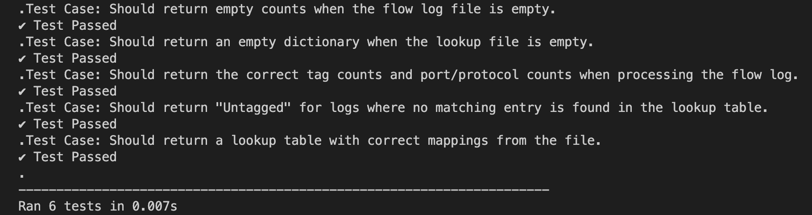

# Flow Log Analyzer

This Python program processes flow logs (version 2 format), parses the log data, and maps each flow log entry to a tag based on a lookup table. The program then generates a summary report that includes tag counts and port/protocol combination counts.

## Requirements

- Python 3.x
- No external libraries are required (uses only standard Python libraries).

## Assumptions

- The program **only supports the default log format (version 2)** of Flow Logs.
- The **lookup table** must contain **`dstport`**, **`protocol`**, and **`tag`** columns for matching the flow logs.
- The **protocol number** is mapped to its corresponding name using a predefined dictionary, which **only supports standard protocol numbers** as defined by [IANA Protocol Numbers](https://www.iana.org/assignments/protocol-numbers/protocol-numbers.xhtml).

## How to Run

1. Clone or download this repository to your local machine. [git clone <>]
2. Navigate to the project folder.
3. Ensure that the `data/` folder contains the necessary input files:
   - `sample_flow_logs.txt`: Your flow log data in the correct format (Flow Log, version 2).
   - `lookup_table.csv`: The lookup table CSV file that maps `dstport` and `protocol` to `tag`.
4. Run following command at project root.
```bash
python3 src/run.py
```
5. The report will be generated in `output/flow_log_report.txt`.
6. The output of the terminal should look like this.


## How to run tests

1. Run following command at project root to run tests.
```bash
export PYTHONPATH=./src
python3 -m unittest discover tests/
```
2. The output of the tests should look like this


- **Other Tests Done:**
1. Tested with a maximum flow log file of size 10 MB: [`output/sample_flow_logs_10MB.txt`]
1. Tested with an empty flow log file: [`output/sample_flow_logs_empty.txt`]
2. Tested with a maximum lookup table with 10k records: [`output/lookup_table_10K.csv`]
3. Tested with an empty lookup table: [`output/lookup_table_empty.csv`]

## How the Program Works

1. Mappings
   - Creates a `protocol_map` to map `protocol_code -> protocol_name`.
   - Creates a `lookup_table ((dstport, protocol) -> tag)` by reading `lookup_table.csv`.
2. Processing the Flow Logs:
   - The program reads each line from the flow log file, extracts the `dstport` and `protocol`, and uses the lookup table to assign a tag.
   - If no match is found for a particular `dstport` and `protocol` combination, the tag `Untagged` is assigned.
3. Generating the Report:
   - The program counts how many times each `tag` appears and how many times each `(dstport, protocol)` combination is found in the flow logs.
   - The results are written to a text file: `(flow_log_report.txt)`.

## Runtime Complexity

The program operates with the following time and space complexities:

- **Time Complexity**:

  - **Processing the Flow Logs**: `O(m)` where `m` is the number of flow log entries.
  - **Reading the Lookup File**: `O(n)` where `n` is the number of rows in the lookup table.
  - **Generating the Report**: `O(k + n)` where `k` is the number of tags mapped and `n` is the number of unique `(dstport, protocol)` combinations.

  **Overall Time Complexity**: `O(m + n)`.

- **Space Complexity**:
  - **Space Complexity**: `O(n + m)` where:
    - `m` is the number of unique tag and port/protocol combinations found in the flow logs (stored in the respective count dictionaries).
    - `n` is the number of entries in the lookup table (stored as `(dstport, protocol)` keys and their corresponding tags).

These complexities are linear, meaning the program should scale reasonably well with large datasets.
